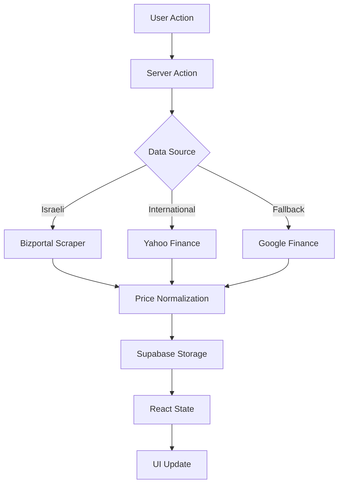

<div align="center">

# Portfolio Rebalancer

Real-time portfolio management and rebalancing for Israeli and international securities

[](https://nextjs.org/)
[](https://www.typescriptlang.org/)
[](https://supabase.com/)
[](https://tailwindcss.com/)

[Features](#features) • [Tech Stack](#tech-stack) • [Getting Started](#getting-started) • [Architecture](#architecture) • [Deployment](#deployment)

</div>

---

## Overview

A brutalist-aesthetic portfolio management platform that tracks Israeli TASE securities, international stocks, and mutual funds. Built for precision, speed, and real-time decision-making.

### Key Capabilities

- **Multi-source price aggregation** from Bizportal, Yahoo Finance, and Google Finance
- **Intelligent rebalancing calculator** with target allocation optimization
- **Manual price overrides** with 15-minute time windows
- **Real-time portfolio visualization** with interactive allocation charts
- **Sequential price fetching** with rate limiting and caching
- **Asset status management** with persistent ON/OFF toggles

---

## Features

### 🎯 Portfolio Management

```typescript
// Automatic price discovery across multiple sources
Israeli Securities (TASE)  → Bizportal scraping (agorot → shekel conversion)
International Stocks       → Yahoo Finance + Google Finance fallback
Mutual Funds              → Bizportal API with 15-minute cache
```

- **Setup wizard** for portfolio initialization
- **Asset CRUD operations** with immediate UI updates
- **Search, sort, and filter** across all holdings
- **Target allocation tracking** with deviation indicators

### 📊 Rebalancing Engine

- Calculate optimal buy/sell orders to match target allocations
- Factor in cash injections and current holdings
- Display trade recommendations with precise quantities
- Real-time recalculation as prices update

### 💾 Data Persistence

- **Supabase backend** for authentication and storage
- **Manual price overrides** stored with timestamps
- **Asset active status** persisted to database
- **Portfolio state** synchronized across sessions

### 🎨 Design System

- **Brutalist aesthetic** with sharp edges and high contrast
- **Mint green (#00FF88)** primary color on black background
- **Responsive layout** with mobile-first approach
- **Dark mode** with theme persistence
- **Smooth animations** for state transitions

---

## Tech Stack

### Core Framework
- **Next.js 16.2** - React framework with App Router
- **React 19.2** - UI library with Server Components
- **TypeScript 5** - Type-safe development

### Backend & Auth
- **Supabase** - PostgreSQL database + authentication
- **Server Actions** - Type-safe API layer

### Styling
- **Tailwind CSS 4** - Utility-first styling
- **shadcn/ui** - Accessible component primitives
- **Lucide React** - Icon system
- **Recharts** - Data visualization

### Data Sources
- **yahoo-finance2** - International stock prices
- **Cheerio** - HTML parsing for web scraping
- **Custom scrapers** - Bizportal ETF/mutual fund data

---

## Getting Started

### Prerequisites

```bash
Node.js 20+
npm/yarn/pnpm
Supabase account
```

### Installation

1. **Clone the repository**
```bash
git clone <repository-url>
cd portfolio-rebalancer
```

2. **Install dependencies**
```bash
npm install
```

3. **Configure environment variables**
```bash
cp .env.example .env.local
```

Required variables:
```env
NEXT_PUBLIC_SUPABASE_URL=your_supabase_url
NEXT_PUBLIC_SUPABASE_ANON_KEY=your_supabase_anon_key
NEXT_PUBLIC_APP_URL=http://localhost:3000
```

4. **Set up database schema**
```sql
-- portfolios table
create table portfolios (
  id uuid primary key default uuid_generate_v4(),
  user_id uuid references auth.users not null,
  name text not null,
  currency text default 'ILS',
  created_at timestamp with time zone default now()
);

-- assets table
create table assets (
  id uuid primary key default uuid_generate_v4(),
  portfolio_id uuid references portfolios on delete cascade,
  ticker text not null,
  name text,
  target_percentage numeric not null,
  shares_owned numeric not null,
  manual_price_override numeric,
  manual_price_set_at timestamp with time zone,
  is_active boolean default true,
  created_at timestamp with time zone default now()
);
```

5. **Run development server**
```bash
npm run dev
```

Open [http://localhost:3000](http://localhost:3000)

---

## Architecture

### Project Structure

```
src/
├── app/
│   ├── api/
│   │   └── etf/[securityId]/     # Bizportal scraping endpoint
│   ├── auth/
│   │   └── callback/             # OAuth callback handler
│   ├── dashboard/                # Main portfolio view
│   ├── login/                    # Authentication page
│   └── layout.tsx                # Root layout with theme
├── actions/
│   ├── auth.ts                   # Authentication actions
│   ├── finance.ts                # Price fetching logic
│   └── portfolio.ts              # CRUD operations
├── components/
│   ├── dashboard/
│   │   ├── assets-list.tsx       # Portfolio table with search/sort
│   │   ├── header.tsx            # Dashboard navigation
│   │   ├── rebalance-calculator.tsx  # Trade recommendations
│   │   └── tradingview-widget.tsx    # Market data widget
│   ├── ui/                       # shadcn components
│   ├── allocation-chart.tsx      # Pie chart visualization
│   ├── dashboard-shell.tsx       # Main layout container
│   ├── setup-wizard.tsx          # Portfolio initialization
│   └── theme-provider.tsx        # Dark mode context
├── lib/
│   ├── scrapeBizportalEtf.ts     # Israeli securities scraper
│   ├── types.ts                  # TypeScript interfaces
│   └── utils.ts                  # Utility functions
└── utils/
    └── supabase/                 # Supabase client configs
```

### Data Flow



### Price Fetching Strategy

1. **Check manual override** (15-minute window)
2. **Israeli securities** (6-8 digit tickers) → Bizportal
3. **International stocks** → Google Finance → Yahoo Finance
4. **Currency conversion** (USD/GBP → ILS)
5. **Sequential requests** with 300ms + 200ms delays
6. **Incremental UI updates** as prices arrive

---

## Deployment

### Vercel (Recommended)

1. **Connect repository** to Vercel
2. **Configure environment variables** in project settings
3. **Deploy** - automatic on push to main

### Environment Variables

```env
# Supabase
NEXT_PUBLIC_SUPABASE_URL=
NEXT_PUBLIC_SUPABASE_ANON_KEY=

# Application
NEXT_PUBLIC_APP_URL=https://your-domain.vercel.app
```

### Build Command

```bash
npm run build
```

---

## Development

### Code Style

- **TypeScript strict mode** enabled
- **Server Actions** for data mutations
- **Client Components** only when necessary
- **Tailwind** for all styling (no CSS modules)

### Performance Optimizations

- **Sequential price fetching** to avoid rate limits
- **15-minute API response caching**
- **Incremental UI updates** during data loading
- **Optimistic updates** for asset toggles
- **Memoized calculations** for portfolio totals

### Keyboard Shortcuts

- `Alt + R` - Refresh prices
- `Alt + C` - Open rebalance calculator
- `Alt + A` - Add new asset

---

## Database Schema

### portfolios

| Column | Type | Description |
|--------|------|-------------|
| id | uuid | Primary key |
| user_id | uuid | Foreign key to auth.users |
| name | text | Portfolio name |
| currency | text | Base currency (default: ILS) |
| created_at | timestamp | Creation timestamp |

### assets

| Column | Type | Description |
|--------|------|-------------|
| id | uuid | Primary key |
| portfolio_id | uuid | Foreign key to portfolios |
| ticker | text | Security identifier |
| name | text | Asset name (auto-fetched) |
| target_percentage | numeric | Target allocation % |
| shares_owned | numeric | Current inventory |
| manual_price_override | numeric | Manual price (optional) |
| manual_price_set_at | timestamp | Override timestamp |
| is_active | boolean | Include in calculations |
| created_at | timestamp | Creation timestamp |

---

## Troubleshooting

### Prices not loading

1. Check Supabase connection
2. Verify `NEXT_PUBLIC_APP_URL` is set correctly
3. Check browser console for CORS errors
4. Ensure sequential fetching isn't being rate-limited

### Manual override not persisting

1. Verify database schema includes `manual_price_override` and `manual_price_set_at`
2. Check that timestamp is within 15-minute window
3. Ensure `updateAsset` action is being called

### Israeli securities returning 0

1. Verify security ID is 6-8 digits
2. Check if security exists on Bizportal
3. Try both ETF and mutual fund endpoints
4. Ensure agorot → shekel conversion (÷ 100)

---

## License

MIT

---

## Acknowledgments

- **Bizportal** for Israeli securities data
- **Yahoo Finance** for international market data
- **Supabase** for backend infrastructure
- **Vercel** for hosting platform

---

<div align="center">

Built with precision for portfolio optimization

</div>
