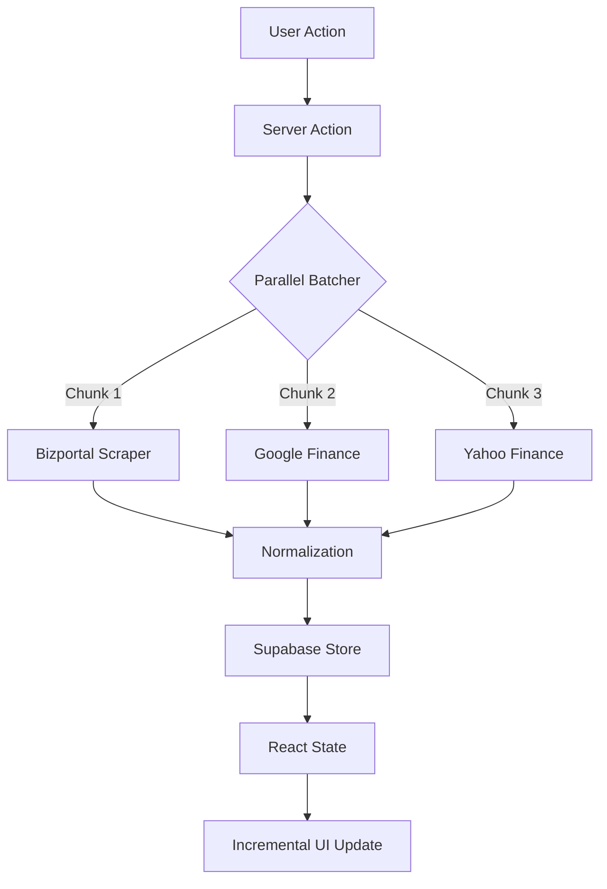

<div align="center">

# Portfolio Rebalancer

Real-time portfolio management and rebalancing for Israeli and international securities

**[Live Website](https://stocks-rebalancer.vercel.app)**

[](https://nextjs.org/)
[](https://www.typescriptlang.org/)
[](https://supabase.com/)
[](https://tailwindcss.com/)

[Features](#features) • [Tech Stack](#tech-stack) • [Getting Started](#getting-started) • [Architecture](#architecture) • [Deployment](#deployment)

</div>

---

## Overview

A brutalist-aesthetic portfolio management platform that tracks Israeli TASE securities, international stocks, and mutual funds. Built for precision, speed, and real-time decision-making.

### Key Capabilities

- **High-speed parallel price aggregation** from Bizportal, Yahoo Finance, and Google Finance
- **ScraperAPI integration** for robust data acquisition and rate-limit bypassing
- **Intelligent rebalancing calculator** with target allocation optimization
- **Manual drag-and-drop reordering** for personalized portfolio organization
- **Exposure Analytics** with Israeli vs. Global breakdown tooltips
- **Real-time portfolio visualization** with interactive allocation charts
- **Incremental UI updates** as prices arrive in chunks
- **Asset status management** with persistent ON/OFF toggles

---

## Features

### 🎯 Portfolio Management

```typescript
// Multi-source intelligence with automated fallbacks
Israeli Securities (TASE)  → Bizportal Scraper (with ScraperAPI IL-proxy)
International Stocks       → Google Finance → Yahoo Finance Fallback
Mutual Funds              → Bizportal API with automated discovery
```

- **Setup wizard** for rapid portfolio initialization
- **Asset CRUD operations** with immediate UI synchronization
- **Search, sort, and filter** across tickers, names, values, and status
- **Manual Price Overrides** with 15-minute persistent windows
- **Target allocation tracking** with color-coded deviation indicators

### 📊 Rebalancing Engine

- Calculate optimal buy/sell orders to match target allocations
- Factor in cash injections and current holdings
- Display trade recommendations with precise quantities
- Real-time recalculation as prices update or overrides are applied

### 💾 Data Persistence

- **Supabase backend** for secure authentication and relational storage
- **Manual price overrides** stored with precise timestamps
- **Asset active status** and **Display Order** persisted to database
- **Portfolio state** synchronized across all user sessions

### 🎨 Design System

- **Brutalist aesthetic** with sharp edges, high contrast, and glow effects
- **Mint green (#00FF88)** primary color on deep black background
- **Responsive layout** with dedicated mobile-first interactions
- **Dark mode** with theme persistence via `next-themes`
- **Smooth micro-animations** for loading states and transitions

---

## Tech Stack

### Core Framework
- **Next.js 16.2** - React framework with App Router & Server Actions
- **React 19.2** - UI library with Server Components & Hooks
- **TypeScript 5** - Type-safe development

### Backend & Auth
- **Supabase** - PostgreSQL database + GoTrue authentication
- **Server Actions** - Secure, type-safe API layer

### Styling & UI
- **Tailwind CSS 4** - Modern utility-first styling
- **@base-ui/react** - Unstyled, accessible component primitives
- **shadcn/ui** - Tailored component system
- **sonner** - High-performance toast notifications
- **Lucide React** - Icon system
- **Recharts** - Dynamic data visualization

### Data Sources
- **ScraperAPI** - Proxy service for reliable web scraping
- **yahoo-finance2** - International market data
- **Cheerio** - HTML parsing for Bizportal and Google Finance
- **Custom scrapers** - Resilient Israeli security data extraction

---

## Getting Started

### Prerequisites

```bash
Node.js 20+
npm/yarn/pnpm
Supabase account
ScraperAPI key (optional but recommended)
```

### Installation

1. **Clone the repository**
```bash
git clone <repository-url>
cd portfolio-rebalancer
```

2. **Install dependencies**
```bash
npm install
```

3. **Configure environment variables**
```bash
cp .env.example .env.local
```

Required variables:
```env
NEXT_PUBLIC_SUPABASE_URL=your_supabase_url
NEXT_PUBLIC_SUPABASE_ANON_KEY=your_supabase_anon_key
NEXT_PUBLIC_APP_URL=http://localhost:3000
SCRAPER_API_KEY=your_scraper_api_key
```

4. **Set up database schema**

```sql
-- portfolios table
create table portfolios (
  id uuid primary key default uuid_generate_v4(),
  user_id uuid references auth.users not null,
  name text not null,
  currency text default 'ILS',
  created_at timestamp with time zone default now()
);

-- assets table
create table assets (
  id uuid primary key default uuid_generate_v4(),
  portfolio_id uuid references portfolios on delete cascade,
  ticker text not null,
  name text,
  target_percentage numeric not null,
  shares_owned numeric not null,
  manual_price_override numeric,
  manual_price_set_at timestamp with time zone,
  is_active boolean default true,
  display_order integer default 0,
  created_at timestamp with time zone default now()
);
```

5. **Run development server**
```bash
npm run dev
```

Open [http://localhost:3000](http://localhost:3000)

---

## Architecture

### Project Structure

```
src/
├── app/
│   ├── api/
│   │   └── etf/[securityId]/     # Bizportal scraping endpoint
│   ├── auth/                     # OAuth & Auth logic
│   ├── dashboard/                # Main portfolio terminal
│   ├── login/                    # Auth entry point
│   └── layout.tsx                # Global providers (Theme, Auth)
├── actions/
│   ├── auth.ts                   # Auth Server Actions
│   ├── finance.ts                # Parallel price fetching logic
│   └── portfolio.ts              # CRUD & Reordering operations
├── components/
│   ├── dashboard/
│   │   ├── assets-list.tsx       # Drag-and-drop table with search
│   │   ├── header.tsx            # Navigation & Shortcuts
│   │   ├── rebalance-calculator.tsx # Math engine
│   │   └── tradingview-widget.tsx # Market charts
│   ├── allocation-chart.tsx      # Pie chart visualization
│   ├── stock-detail-modal.tsx    # Asset deep-dive
│   ├── dashboard-shell.tsx       # State management & Shortcuts
│   ├── setup-wizard.tsx          # Initialization flow
│   └── spicy-loading-spinner.tsx # Custom brutalist loader
├── lib/
│   ├── scrapeBizportalEtf.ts     # ScraperAPI-powered crawler
│   ├── getBaseUrl.ts             # Dynamic URL resolver
│   ├── types.ts                  # Shared TS interfaces
│   └── utils.ts                  # Helper functions
└── utils/
    └── supabase/                 # Client/Server/SSR configs
```

### Data Flow



### Price Fetching Strategy

1. **Check manual override**: Use DB value if set within the last 15 minutes.
2. **Parallel Dispatch**: Fetch multiple assets simultaneously (concurrency limit: 3).
3. **Israeli Detection**: Use Bizportal Scraper with `country_code=il` via ScraperAPI.
4. **International Flow**: Attempt Google Finance (via ScraperAPI) → Fallback to Yahoo Finance.
5. **Currency Sync**: Automatic USD/ILS and GBp/ILS conversion.

---

## Deployment

### Vercel (Recommended)

1. **Connect repository** to Vercel
2. **Configure environment variables** in project settings
3. **Deploy** - automatic on push to main

### Environment Variables

```env
# Supabase
NEXT_PUBLIC_SUPABASE_URL=
NEXT_PUBLIC_SUPABASE_ANON_KEY=

# Services
SCRAPER_API_KEY=

# Application
NEXT_PUBLIC_APP_URL=https://stocks-rebalancer.vercel.app
```

---

## Development

### Performance Optimizations

- **Parallel Batching**: Reduced total fetch time by 70% vs sequential.
- **Incremental Hydration**: UI updates as each price arrives, avoiding long "all-or-nothing" waits.
- **15-minute TTL**: Persisted manual overrides for fast re-calculating.
- **Optimistic UI**: Immediate feedback for asset toggles and reordering.
- **Memoized Analytics**: High-performance allocation math.

### Keyboard Shortcuts

- `Alt + R` - Refresh all prices
- `Alt + C` - Toggle rebalance calculator
- `Alt + A` - Trigger "Add Asset" modal
- `Escape` - Close all modals/drawers

---

## Troubleshooting

### Prices returning 0 or failing
- Ensure `SCRAPER_API_KEY` is active and has remaining credits.
- Check if the security ticker is valid (Israeli: 6-8 digits, International: Yahoo symbol).
- Bizportal may require an IL-based proxy (handled automatically if using ScraperAPI).

### Drag-and-Drop not persisting
- Verify the `assets` table has the `display_order` column.
- Check browser console for database update failures (RLS policies).

### Israeli securities (Agorot vs Shekel)
- Scrapers automatically convert Bizportal prices (÷ 100) to maintain ILS consistency.

---

## License

MIT

---

<div align="center">

Built with precision for the modern investor.

</div>
